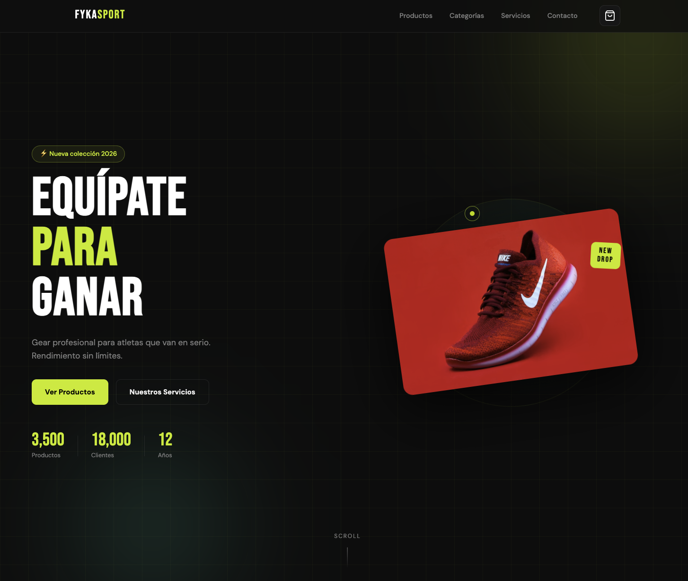
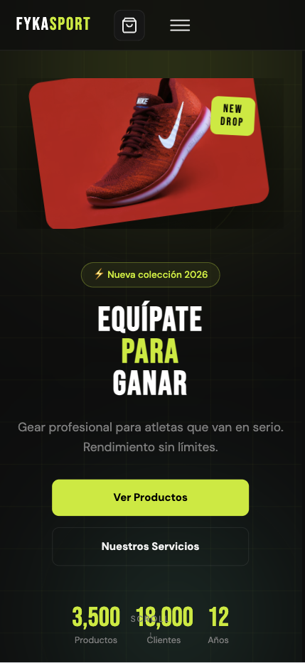

<div align="center">

# ⚡ FYKA SPORT

### Tienda deportiva interactiva — Landing page


> Equípate para ganar. Gear profesional para atletas que van en serio.

[Ver demo](#) · [Reportar un bug](../../issues) · [Sugerir mejora](../../issues)

</div>

---

## 📋 Índice

- [Sobre el proyecto](#sobre-el-proyecto)
- [Capturas de pantalla](#capturas-de-pantalla)
- [Tecnologías](#tecnologías)
- [Funcionalidades](#funcionalidades)
- [Estructura del proyecto](#estructura-del-proyecto)
- [Cómo correr el proyecto](#cómo-correr-el-proyecto)
- [Ramas y flujo de trabajo](#ramas-y-flujo-de-trabajo)
- [Equipo](#equipo)

---

## 🏪 Sobre el proyecto

**FYKA SPORT** es una landing page interactiva para una tienda deportiva. El objetivo fue construir una plataforma online que presente productos y servicios de forma atractiva, intuitiva y completamente responsiva. Enfocada en una sola oferta o acción, deshaciéndonos de más páginas y teniendo toda la información desplegada en una sóla hoja. Diseñada como una Single Page Application (SPA-like) enfocada en conversión y experiencia de usuario.

El proyecto fue desarrollado siguiendo la **metodología SCRUM** en 4 sprints gestionados en Jira como parte de un hackaton académico de 24 hrs por parte de la CH66 de Generation - México, partiendo desde wireframes en Figma hasta el producto final con HTML, CSS y JS.

### Objetivos del proyecto

- Diseño atractivo con identidad visual dark/neón consistente
- Interfaz intuitiva con feedback visual en cada interacción
- Adaptación responsiva a cualquier tamaño de dispositivo
- Carrito de compras funcional con animaciones fluidas
- Formulario de contacto con envío real vía Formspree

---

## 📸 Capturas de pantalla

| Vista desktop | Vista móvil |
|---|---|
|  |  |


---

## 🛠️ Tecnologías

| Tecnología | Uso en el proyecto |
|---|---|
| **HTML5** | Estructura semántica (`<nav>`, `<section>`, `<article>`, `<aside>`) |
| **CSS3** | Variables `:root`, Flexbox, Grid, animaciones `@keyframes`, media queries |
| **JavaScript (ES6+)** | Lógica interactiva, DOM, `fetch`, `IntersectionObserver`, `requestAnimationFrame` |
| **Jira** | Gestión de proyecto - Metodología SCRUM |
| **Figma** | Wireframes low-fi, moodboard, prototipo hi-fi interactivo |
| **Google Fonts** | Tipografías: Bebas Neue (display) + DM Sans (cuerpo) |
| **Unsplash** | Imágenes de productos y categorías |
| **GitHub** | Control de versiones y colaboración en equipo |

---

## ✨ Funcionalidades

### Interfaz
- [x] Banda de texto animada (marquee infinito) con las categorías
- [x] Sección de categorías con hover de zoom e imagen
- [x] Sección de servicios con efecto de gradiente en hover
- [x] CTA banner con código de descuento
- [x] Footer completo con newsletter, links y redes sociales
- [x] Cursor personalizado con punto + anillo seguidor (solo desktop)

### Productos
- [x] Grilla de 12 productos generada dinámicamente desde un array
- [x] Filtros por categoría: Todos / Running / CrossFit / Ciclismo / Natación
- [x] Animación de fade al cambiar de categoría
- [x] Badge de tipo por producto: NUEVO / OFERTA / TOP
- [x] Sistema de favoritos (wishlist) con ícono de corazón
- [x] Precio anterior tachado cuando hay descuento
- [x] Calificación con estrellas y número de reseñas

### Carrito de compras
- [x] Panel lateral (drawer) con animación slide desde la derecha
- [x] Agregar productos con animación de bounce en el botón
- [x] Control de cantidad (+ / −) con actualización inmediata
- [x] Eliminar ítems individualmente
- [x] Total calculado automáticamente
- [x] Contador de ítems sobre el ícono del navbar
- [x] Modal de confirmación al finalizar la compra
- [x] Cierre con tecla Escape, clic en overlay o botón X

### Animaciones
- [x] Animaciones de entrada al hacer scroll (`reveal-up`, `reveal-left`, `reveal-right`)
- [x] Efecto stagger (delay escalonado) en elementos de la misma sección
- [x] Contadores animados con curva easeOutExpo en las estadísticas del hero
- [x] Blobs de fondo animados en el hero con `@keyframes`
- [x] Scroll spy: resalta el link activo del navbar según la sección visible

### Formulario y navbar
- [x] Navbar sticky con cambio de fondo al hacer scroll
- [x] Menú hamburger para dispositivos móviles
- [x] Scroll suave al hacer clic en links del navbar
- [x] Formulario de contacto con envío real a Formspree
- [x] Validación de campos y mensajes de error/éxito
- [x] Toast de notificación en todas las acciones del usuario
- [x] Newsletter con validación de email

### Diseño responsivo
- [x] Breakpoint 1100px — footer de 2 columnas
- [x] Breakpoint 900px — hero de 1 columna, categorías en 2×2
- [x] Breakpoint 768px — navbar con hamburger, servicios en 1 columna
- [x] Breakpoint 520px — productos en 1 columna, CTAs full width

---
## 🧠 Arquitectura

El proyecto sigue un enfoque modular basado en:

- Estado global centralizado (`state`)
- Render dinámico del DOM
- Delegación de eventos
- Separación por responsabilidades

Patrones aplicados:
- Event Delegation
- Lazy Rendering
- State-driven UI

---

## 📁 Estructura del proyecto

```
fyka-sport/
│
├── index.html          # Estructura HTML completa y semántica
├── styles.css          # Todos los estilos, variables y animaciones CSS
├── script.js              # Toda la lógica JavaScript (13 módulos documentados)
├── images/             # Imágenes del README
│   ├── Categorías.png
│   ├── Contacto.png
│   ├── Figma.png
│   ├── Jira.png
│   ├── Portada.png
│   ├── Productos.png
│   └── Servicios.png
└── README.md           # Este archivo
```

### Descripción de cada archivo

**`index.html`** — Contiene la estructura de todas las secciones de la página: navbar, hero, marquee, categorías, productos, servicios, CTA banner, contacto, footer, carrito lateral, toast y modal de confirmación. Todo el HTML usa etiquetas semánticas y atributos ARIA para accesibilidad.

**`styles.css`** — Organizado en módulos con comentarios. Incluye las variables de diseño en `:root` (colores, tipografías, radios, sombras), estilos de todos los componentes, animaciones con `@keyframes` y los 4 breakpoints de media queries.

**`app.js`** — Dividido en 19 secciones comentadas. Cada función tiene documentación con descripción del flujo, parámetros y notas técnicas. No usa ningún framework ni librería externa.

---

## 🚀 Cómo correr el proyecto

No se requiere ninguna instalación. Solo necesitas un navegador web moderno.

### Opción 1 — Abrir directo (más simple)

```bash
# 1. Clonar el repositorio
git clone https://github.com/FerZamu-byte/Landing_Page_room4

# 2. Entrar a la carpeta
cd fyka-sport

# 3. Abrir index.html en tu navegador
# En Mac:
open index.html
# En Windows:
start index.html
# En Linux:
xdg-open index.html
```

### Opción 2 — Con Live Server (recomendado para desarrollo)

```bash
# 1. Instalar la extensión Live Server en VS Code
# 2. Clic derecho en index.html → "Open with Live Server"
# 3. Se abre automáticamente en http://127.0.0.1:5500
```

### Configurar el formulario de contacto

El formulario usa Formspree. Para que los mensajes lleguen a **tu** correo:

1. Crear cuenta en [formspree.io](https://formspree.io)
2. Crear un nuevo formulario y copiar tu endpoint
3. Abrir `index.html` y buscar la línea:
   ```html
   action="https://formspree.io/f/xojyovle"
   ```
4. Reemplazar `xojyovle` con tu propio endpoint
5. Confirmar el formulario desde el email que te envíe Formspree

---

## 🌿 Ramas y flujo de trabajo

El proyecto usa **Git Flow** con la metodología SCRUM.

### Ramas permanentes

| Rama | Propósito |
|---|---|
| `main` | Código en producción. Solo recibe merges al final de cada sprint. |
| `develop` | Rama de integración. Aquí se fusionan todos los Pull Requests. |

### Ramas de funcionalidad

| Rama | Responsable | Contenido |
|---|---|---|
| `carrito-y-filtros` | Kaleb | `app.js` — lógica de carrito, filtros, animaciones JS |
| `estilos-y-animaciones` | Yarilis | `styles.css` — variables, hero, animaciones, responsivo |
| `estructura-html` | Arturo | `index.html` — HTML semántico, navbar, hero, contacto, QA |
| `componentes-y-docs` | Fernando | Secciones, footer, breakpoints, README |

### Flujo diario

```bash
# Antes de empezar a trabajar
git checkout develop
git pull origin develop
git checkout feature/TU-RAMA
git merge develop

# Al terminar una tarea
git add .
git commit -m "feat: descripción de lo que hiciste"
git push origin feature/TU-RAMA

# Abrir Pull Request en GitHub: base develop ← compare TU-RAMA
```

### Convención de commits

| Prefijo | Cuándo usarlo |
|---|---|
| `feat:` | Nueva funcionalidad |
| `fix:` | Corrección de bug |
| `style:` | Cambios de CSS/estilos |
| `docs:` | Cambios en documentación |
| `refactor:` | Mejora de código sin cambiar funcionalidad |

---

## 👥 Equipo

| Nombre | Rol | Rama |
|---|---|---|
| **Iván Kaleb Ramírez Torres** | Scrum Master / Dev Full-Stack | `carrito-y-filtros` |
| **Yarilis Hernandez Rosete** | UI/UX Designer / Dev Frontend | `estilos-y-animaciones` |
| **Jose Arturo Ramírez Soto** | Dev Frontend / QA Tester | `estructura-html` |
| **Fernando Antonio Zamudio Olguin** | Dev Frontend / Documentación | `componentes-y-docs` |

---

## 📄 Licencia

Este proyecto fue desarrollado con fines educativos para la materia de Desarrollo Web.

---

<div align="center">

Hecho con ⚡ por el equipo FYKA SPORT — 2026

</div>